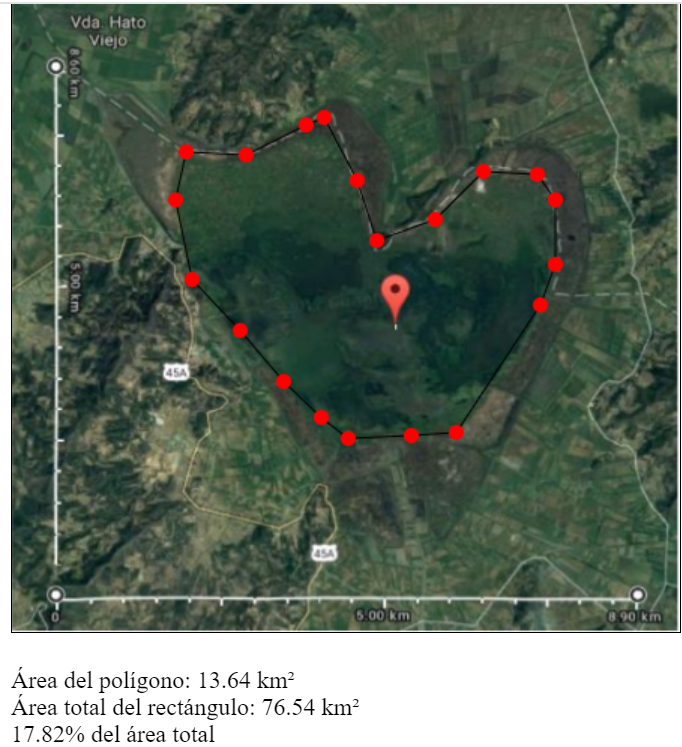
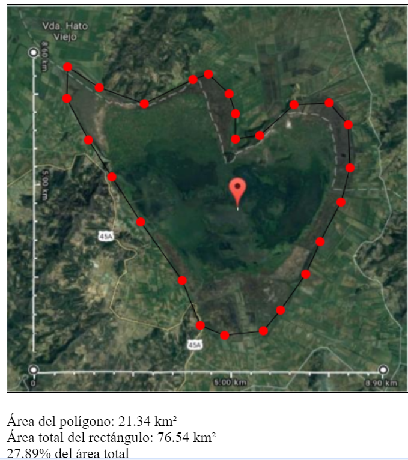

# Sistema de Cálculo de Distancias utilizando la Fórmula de Haversine

Este sistema de software ha sido desarrollado para calcular distancias entre ubicaciones geográficas utilizando la fórmula de Haversine. A continuación, se presentan los casos de estudio con las ubicaciones correspondientes a las coordenadas dadas y sus respectivas distancias.

## Casos de Estudio

### Caso 1: Teusaquillo y Engativá
- **Punto 1**: Localidad de Teusaquillo  
- **Punto 2**: Localidad de Engativá  
  - **Distancia (Haversine)**: 6.86 km  
  - **Distancia (Google Maps)**: 10.7 km  

### Caso 2: Popayán y Armenia
- **Punto 1**: Popayán  
- **Punto 2**: Armenia  
  - **Distancia (Haversine)**: 250.18 km  
  - **Distancia (Google Maps)**: 301 km  

### Caso 3: Bucaramanga y Boston
- **Punto 1**: Bucaramanga  
- **Punto 2**: Boston  
  - **Distancia (Haversine)**: 3921.14 km  

## Conclusión

Las diferencias de distancias entre los métodos Haversine y Google Maps se deben a que Haversine calcula distancias en línea recta, mientras que Google Maps considera las rutas reales, lo que resulta en distancias mayores.

## Áreas de Estudio

### Área 1

### Área 2

